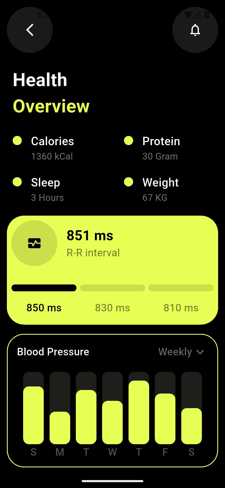
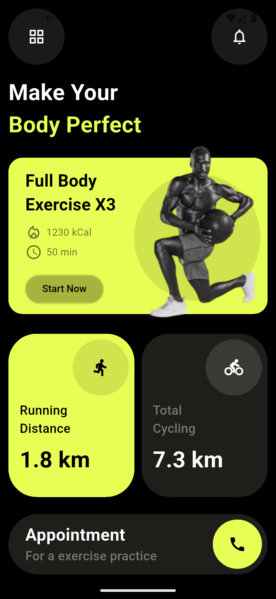

# 🏋️ Fitness Tracker App

A modern fitness tracking mobile application built with Flutter featuring a sleek dark theme with neon green accents. Practice project for learning Flutter UI development and state management.


## 📱 Screenshots

<div align="center">
  
  
</div>

## ✨ Features

### 🏠 Home Screen

-   **Exercise Hero Card** - Full body exercise program with calorie (1230 kCal) and duration (50 min) info
-   **Activity Metrics** - Running distance (1.8 km) and cycling distance (7.3 km) cards with dual-theme styling
-   **Appointment Section** - Quick access to exercise practice scheduling with call button
-   **Custom Navigation** - Circular icon buttons for menu and notifications

### 📊 Health Overview Screen

-   **Health Metrics Dashboard** - Track 4 key metrics: Calories (1360 kCal), Protein (30g), Sleep (3 hrs), Weight (67 kg)
-   **Heart Rate Monitoring** - R-R interval display (851 ms) with time interval tracking (850/830/810 ms)
-   **Blood Pressure Chart** - Weekly bar chart visualization with day labels (S-M-T-W-T-F-S)
-   **Interactive UI** - Back navigation and notification access

## 🛠️ Tech Stack

-   **Framework**: Flutter 3.10.1+
-   **Language**: Dart
-   **UI**: Material Design with custom components
-   **Charting**: fl_chart ^1.1.1

## 📦 Dependencies

```yaml
dependencies:
    flutter:
        sdk: flutter
    cupertino_icons: ^1.0.8
    fl_chart: ^1.1.1
```

## 🚀 Getting Started

### Prerequisites

-   Flutter SDK 3.10.1 or higher
-   Dart SDK
-   VS Code or Android Studio
-   Android Emulator / iOS Simulator

### Installation

1. **Clone the repository**

    ```bash
    git clone https://github.com/newbie-saimur/fitness-tracker-app-flutter.git
    cd fitness-tracker-app-flutter
    ```

2. **Install dependencies**

    ```bash
    flutter pub get
    ```

3. **Run the app**
    ```bash
    flutter run
    ```

### Build

**Android APK:**

```bash
flutter build apk --release
```

**iOS:**

```bash
flutter build ios --release
```

## 📁 Project Structure

```
lib/
├── main.dart                      # App entry point
├── views/
│   ├── HomePage/
│   │   └── homepage_screen.dart   # Main home screen
│   └── FitnessTracker/
│       └── fitness_tracker.dart   # Health tracking screen
├── widgets/
│   ├── custom_hero_card.dart      # Featured exercise card
│   ├── custom_details_card.dart   # Activity metric cards
│   ├── custom_overview_card.dart  # Heart rate monitoring widget
│   ├── health_metric_tile.dart    # Health stat tiles
│   ├── blood_pressure_card.dart   # BP chart container
│   ├── custom_bar_chart.dart      # Weekly bar chart
│   ├── custom_circle_button.dart  # Circular icon buttons
│   ├── custom_icon_text.dart      # Icon + text row
│   └── custom_time_tracker.dart   # Time interval indicators
└── utils/
    ├── colors.dart                # Color constants (#E7FE55, #1E1F1A, #000000)
    └── text_style.dart            # Reusable text styles
```

## 🎨 Custom Widgets

### Core Components

-   **CustomHeroCard** - Hero banner with exercise info, image overlay, and CTA button
-   **CustomDetailsCard** - Flexible metric card with icon, supports light/dark theme
-   **CustomOverviewCard** - Heart rate display with time interval timeline
-   **HealthMetricTile** - Dot indicator + title/value display for health stats
-   **BloodPressureCard** - Container with dropdown and chart integration
-   **CustomBarChart** - fl_chart BarChart with weekly data and bottom labels
-   **CustomCircleButton** - Reusable circular button with tap handler
-   **CustomIconText** - Icon and text combination widget
-   **CustomTimeTracker** - Visual time indicator with filled/unfilled state

### Text Utilities

-   `headingTwo()` - 32px bold headings
-   `headingThree()` - 24px bold subheadings
-   `bodyLarge()` - 18px medium text
-   `bodyNormal()` - 16px regular text

## 🎯 Learning Outcomes

This project demonstrates:

-   Flutter layout system (Container, Row, Column, Stack)
-   Custom reusable widget architecture
-   fl_chart integration for data visualization
-   Navigation between screens
-   Theme consistency with utility files
-   Responsive spacing and alignment
-   State management with StatelessWidget

## 👨‍💻 Author

**newbie-saimur**

-   GitHub: [@newbie-saimur](https://github.com/newbie-saimur)

---

<div align="center">
  Made with ❤️ using Flutter
</div>
